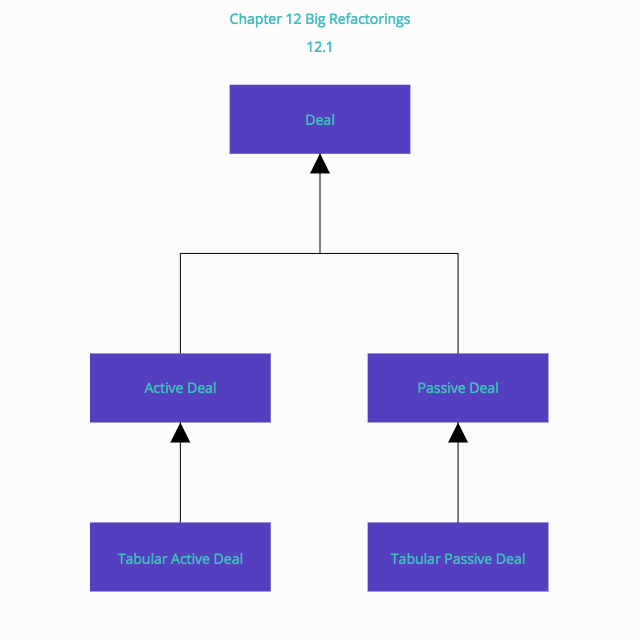
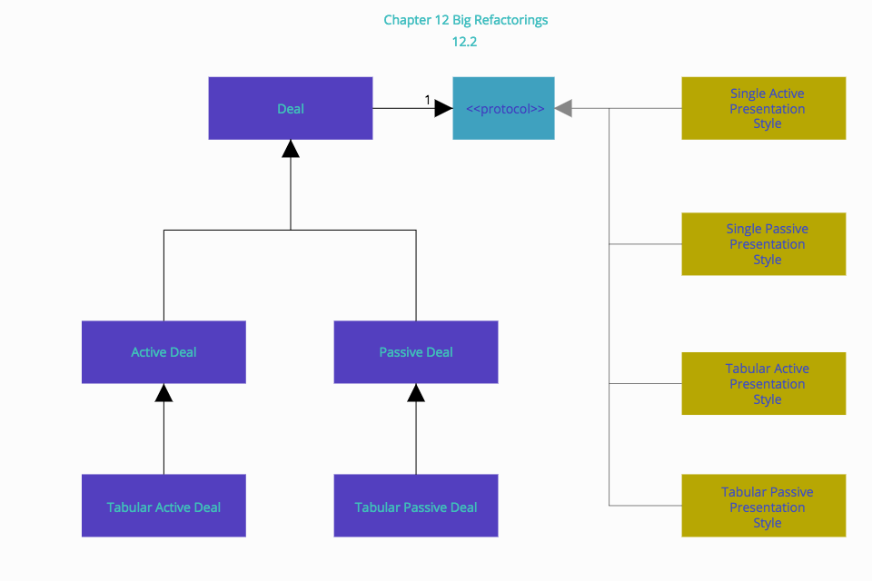
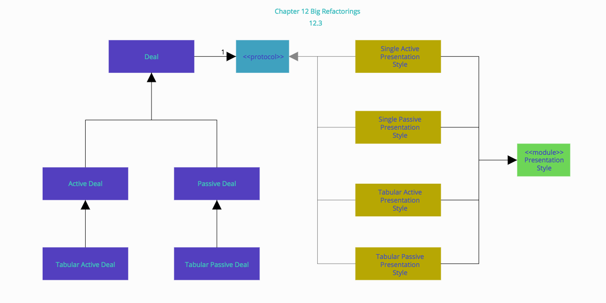
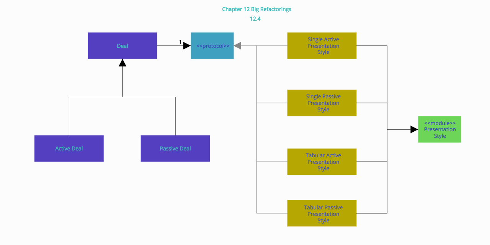
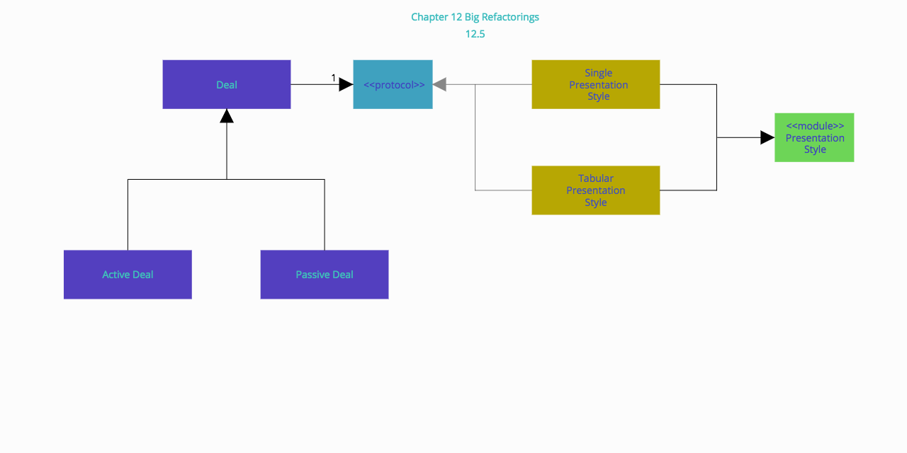
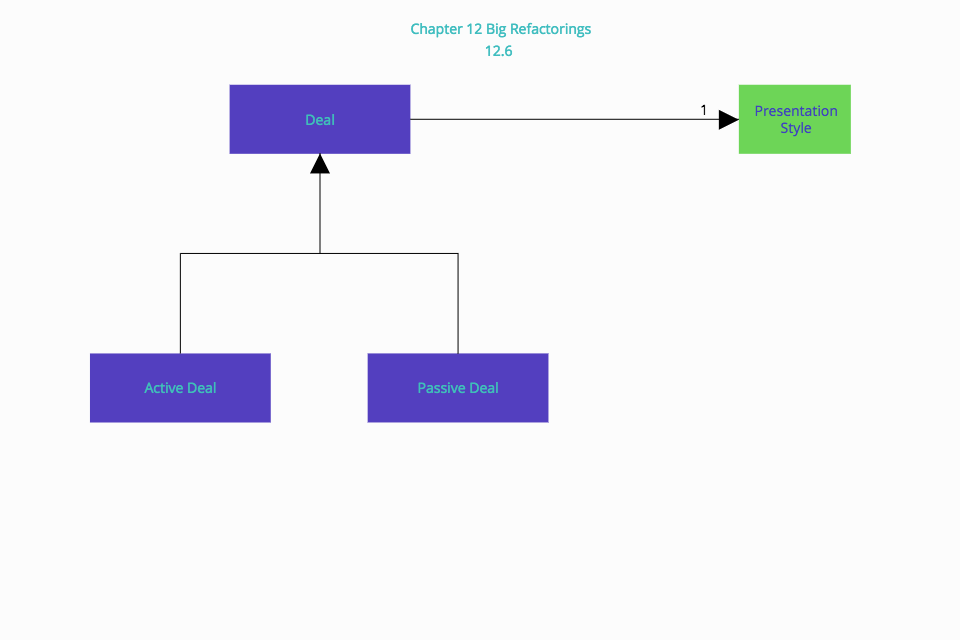

# Chapter 12: Big Refactorings

## The Nature of the Game

大きなリファクタリングでは、小さなリファクタリングでは不要なプログラミングチーム全体の同意が必要である。 大きなリファクタリングは多くの、多くの変更の方向性を設定します。 チーム全体は、大きなリファクタリングの1つが「作業中」であることを認識し、それに従って行動を起こさなければならない

## Why Big Refactorings Are Important

大きなリファクタリングが、小さなリファクタリングを価値あるもの（予測可能性、目に見える進歩、一時の満足感）にするような多くの品質が欠けているなら、なぜそれらを本書に入れたいと思うほどにとても重要なのか？  
それがなければ、時間と労力を投資してリファクタリングを学び、実際にリファクタリングし、利益を得られないリスクがある。それは私たちに非常に悪い形で反映される。私たちはそれには耐えられない

真面目な話、あなたは楽しむためにリファクタリングするのではなく、あなたがリファクタリングしていない場合にはできないことをリファクタリングすれば、あなたのプログラムでできることが期待されるものがある

中途半端に理解された設計決定の蓄積は、最終的に水草が運河を詰まらせるようにプログラムを詰まらせる。リファクタリングによって、プログラムの設計方法を完全に理解していることを常にプログラムに反映させることができる。  
水草がすばやく蔓を広げるにつれて、部分的に理解されていた意思決定がすぐにあなたのプログラム全体にその影響を広げる。問題を根絶するのに十分なのは、1つや2つないしは10つの個別の行動ではない

## Four Big Refactorings

以下の４つの大きなリファクタリング方法がある

### Tease Apart Inheritance
Tease Apart(解きほぐす)継承は、複雑な方法でいくつかのバリエーションを組み合わせていると思われるもつれた継承階層を扱う  
多くのプログラマは、オブジェクトについて実際に知らなくてもオブジェクト指向の言語を使用しているので、これはしばしば行われているリファクタリングである


1.階層によって実行されているさまざまなジョブを識別する。 2次元グリッド（階層が乱雑でとてもクールなグラフ用紙がある場合は3次元ないしは4次元）を作成し、異なるジョブで軸にラベルを付ける

2つ以上の次元でこのリファクタリングを繰り返し適用する必要があると想定している（もちろん、一度に1つ）。

2.現在の階層でどのジョブがより重要か、どのジョブが別の階層に移動されるかを決定する

3.共通スーパークラスの抽出クラス（第6章「メソッドの作成」を参照）を使用して、元の階層の各サブクラスのオブジェクトを作成する

4.新しいオブジェクトを保持するために、スーパークラスにインスタンス変数を追加する。インスタンス変数を適切な新しいクラスに初期化する

5.新しいクラス間で共有される共通コードを格納するために、モジュールを抽出する。このモジュールを新しいクラスにinlcude する

6.各サブクラスの移動方法（第7章「オブジェクト間の移動機能」を参照）を使用して、サブクラスの動作を関連する抽出オブジェクトに移動する

7.サブクラスにコードがなくなったら、それを除去する

8.すべての子サブクラスがなくなるまで続行する。Pull Up Method（第11章「Dealing with Generalization」を参照）など、さらなるリファクタリングができそうな新しい階層を探す



12.1 もつれた階層



12.2 プレゼンテーションスタイルの追加

Extract Module を使用して新しいオブジェクト間の共通の振る舞いを格納する。インスタンス変数を適切な新しいクラスに初期化する

```ruby
class ActiveDeal
  def initialize
    # ...
    @presentation = SingleActivePresentationStyle.new
```



12.3 プレゼンテーションスタイルのサブクラスを追加

Move Method, Move Field を使用して `Deal` subclass のプレゼンテーション関連のメソッドと変数を プレゼンテーションスタイルのクラスへと移動する

そのことにより、`Tabular Active Deal`, `Tabular Passive Deal` の２つを削除することができる



12.4 Deal のTabular subclasses ２つは削除される

次の作業はプレゼンテーションスタイルの `active-passive` の区別を取り除くことである



12.5 階層は分離された

single とtabular の区別でさえいくつかの変数の値で捕捉される。モジュールの階層も不要になる



12.6 プレゼンテーションの違いはいくつかの変数で扱うことができる

### Convert Procedural Design to Objects

手続き型デザインをオブジェクトに変換することで、手続き型コードの古典的な問題を解決できる

手続き型で書かれたコードがある。データをオブジェクトに変換し、振る舞いに分解し、振る舞いをオブジェクトへと移動する

典型的なシチュエーションとしては、長い手続き型のメソッドがクラスにあり、少しのデータとアクセサにすぎない無反応なデータがある

1.各レコードタイプを取り出し、アクセサを使用して無反応なデータオブジェクトに変換する。 リレーショナルデータベースがある場合は、各テーブルを用意して、それを
無反応なデータオブジェクトに変換する

2.すべての手続き型コードをひとつのクラスにまとめる。 クラスメソッドを作ることができる

3.それぞれの長い手続きを取って、Extract Methodと関連するリファクタリングを適用して分解する。 手続きを分割する際には、Move Methodを使用して、それぞれを適切な無反応なデータクラスに移動する

4.元のクラスからすべての動作を削除するまで続行する。 元のクラスが純粋に手続き型のクラスだった場合、それを削除することは非常に喜ばしい

### Separate Domain from Presentation
従来の2層アプローチのユーザーインターフェイスとデータベースに対するコードが書かれている場合、ビジネスロジックをユーザーインターフェイスコードから分離する必要があるなら、プレゼンテーションからドメインを分離する必要がある  
経験豊富なオブジェクト指向の開発者は、この分離は長命で繁栄したシステムにとって不可欠であることを学んだ  

ドメインロジックを含んだビューとコントローラクラスがある

ドメインロジックをモデルへと移動する

ビューはユーザーインターフェースを扱うのに必要なロジックのみを持っている。ドメインオブジェクトはビジュアルに関するコードを持たないが全てのビジネスロジックを持つ

コントローラは、ユーザーの要求を受け入れ、モデルが作業を実行するように構成し、適切なビューを表示させるようにトリガーするだけ

1.ユーザーの要求を受け入れること、モデルが作業を行うように構成すること、または表示される適切なビューをトリガすることとは関係のないコントローラの機能を特定する

2.このコードを調べて、それを置くことができるドメインオブジェクトを決定する。必要に応じて新しいドメインオブジェクトを追加する  
問題のコードを移動する前に、Extract Method の使用が必要な場合がある。ビューとコントローラのドメインロジックの領域につながるショートカットは、多くの場合、プレゼンテーションとドメインロジックをメソッド内で混在させている

3.Move Methodを使用して、それをドメインオブジェクトに移動する

4.テスト

5.表示ロジックに関係のないコードを識別する

6.このコードを調べて、配置可能なドメインオブジェクトを特定する。必要に応じて新しいドメインオブジェクトを追加する。
また、問題のコードを移動する前に、Extract Methodの使用が必要な場合がある

7. Move Methodを使用して、ドメインオブジェクトに移動する

8.テスト

9.終了すると、GUI、要求案内を処理するコントローラ、およびすべてのビジネスロジックを含むドメインオブジェクトを処理するビューが表示される。ドメインオブジェクトはよく要因となるかもしれないが、さらなるリファクタリングでそれに対処する

controller がこうなっている

```ruby
class OrdersController < ApplicationController
  # ...
  MINIMUM_ORDER_AMOUNT = 100

  def create
    @order_lines = []
    params[:order_line].each_value do |order_line_params|
      unless all_values_blank?(order_line_params)
        amount = Product.find(order_line_params[:product_id]).price
        @order_lines << OrderLine.new(
          order_line_params.merge(:amount =>amount)
        )
      end
    end

    @order = Order.new(params[:order])

    if total_amount_for_order_lines(@order_lines) >= MINIMUM_ORDER_AMOUNT
      begin
        Order.transaction do
          @order.order_lines = @order_lines
          @order.save!
        end
      rescue ActiveRecord::ActiveRecordError
        render_new
        return
      end
    else
      flash[:error] = "An order must be at least $#{MINIMUM_ORDER_AMOUNT}"
      render_new
      return
    end
    redirect_to :action => 'index'
  end

  private

  def render_new
    @order_lines = [OrderLine.new] * 5 if @order_lines.empty?
    render :action => 'new'
  end

  def total_amount_for_order_lines(order_lines)
    order_lines.inject(0) do |total, order_line|
      total + (order_line.amount * order_line.quantity)
    end
  end
end
```

ビューはオーダーリストを表示する。テーブルの各オーダーの合計も計算する

```erb
<h3>Orders</h3>
<p><%= link_to 'Add a new Order', new_order_url %></p>
<table>
  <tr>
    <th>Number</th>
    <th>Customer</th>
    <th>Amount</th>
    <th>&nbsp;</th>
  </tr>
  <% @orders.each do |order| %>
    <%
      total = order.order_lines.inject(0) do |total, order_line|
        total + (order_line.amount * order_line.quantity)
      end
    %>
    <tr>
      <td><%= order.number %></td>
      <td><%= order.customer %></td>
      <td><%= total %></td>
      <td><%= link_to 'Show', order_url(order) %></td>
    </tr>
  <% end %>
</table>
```

注文総額の計算ロジックの重複は1つの問題である  
Move Methodを使用して、`total_amount_ for_order_lines` メソッドをビューとコントローラの両方にアクセス可能な場所に置くことで解決できる（おそらくコントローラに含まれるヘルパー内に）  

しかし、そのメソッドをどこに置くかの選択も重要でである。  
注文が$ 100未満の場合、注文は決して有効ではないので、この検証を実行するロジックはモデルに入れなければならない

```ruby
class Order < ActiveRecord::Base
  MINIMUM_ORDER_AMOUNT = 100

  def validate
    if total < MINIMUM_ORDER_AMOUNT
      errors.add_to_base("An order must be at least $#{MINIMUM_ORDER_AMOUNT}")
    end
  end

  def total
    order_lines.inject(0) do |total, order_line|
      total + (order_line.amount * order_line.quantity)
    end
  end
end
```

validate, total のロジックををモデルに持ってくる

次に、このメソッドをコントローラで使用できる。バリデーションをActiveRecord でのバリデーションにすることによって、コントローラのロジックがより簡潔になる

```ruby
class OrdersController < ApplicationController
  # ...
  def create
    @order_lines = []
    params[:order_line].each_value do |order_line_params|
      unless all_values_blank?(order_line_params)
        amount = Product.find(order_line_params[:product_id]).price
        @order_lines << OrderLine.new(
          order_line_params.merge(:amount =>amount)
        )
      end
    end

    @order = Order.new(params[:order])

    begin
      Order.transaction do
        @order.order_lines = @order_lines
        @order.save!
      end
    rescue ActiveRecord::ActiveRecordError
      @order_lines = [OrderLine.new] * 5 if @order_lines.empty?
      render :action => 'new'
      return
    end
    redirect_to :action => 'index'
  end
end
```

View では`order.total` にアクセスすればいいだけ

```erb
<h3>Orders</h3>
<p><%= link_to 'Add a new Order', new_order_url %></p>
<table>
  <tr>
    <th>Number</th>
    <th>Customer</th>
    <th>Amount</th>
    <th>&nbsp;</th>
  </tr>
  <% @orders.each do |order| %>
    <tr>
      <td><%= order.number %></td>
      <td><%= order.customer %></td>
      <td><%= order.total %></td>
      <td><%= link_to 'Show', order_url(order) %></td>
    </tr>
  <% end %>
</table>
```

### Extract Hierarchy
Extract Hierarchyは、過度に複雑なクラスをサブクラスのグループに変換することによって単純化する

過度に多くの処理をしているクラスがあり、少なくとも一部には多くの条件分岐がある

各サブクラスが特定のケースを表しているクラスの階層を作成する

1.バリエーションを特定する。
オブジェクトの存続期間中にバリエーションが変更される場合は、Extract Classを使用してその見かけを別々のクラスに引き込む

2.その特殊ケースのサブクラスを作成し、オリジナル（のクラス）に対してFactory MethodとともにReplace Constructorを使用する。 必要に応じて、サブクラスのインスタンスを返すようにファクトリメソッドを変更する

3.サブクラスに条件ロジックを含むメソッドをコピーしてから、メソッドをシンプルにして、スーパークラスのインスタンスではなくサブクラスのインスタンスだと確かに言うことができるようにする。 必要であれば、スーパークラスでExtract Methodを使用して、メソッドの条件分岐の部分を無条件部分から分離する

4.すべてのスーパークラスメソッドがサブクラス実装を持つまで、特殊ケースを分離し続ける

5.すべてのサブクラスでオーバーライドされたスーパークラス内のメソッドを削除する

6.スーパークラスが直接インスタンス化されなくなった場合、Replace Abstract Superclass with Moduleを使用する
